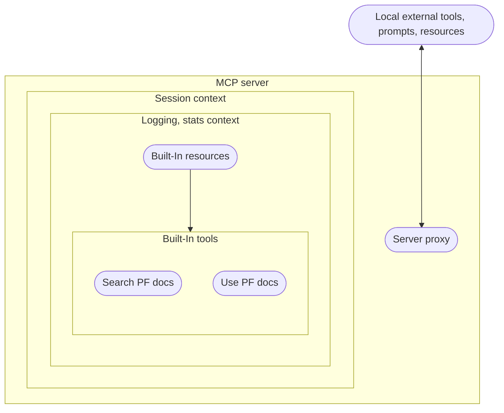
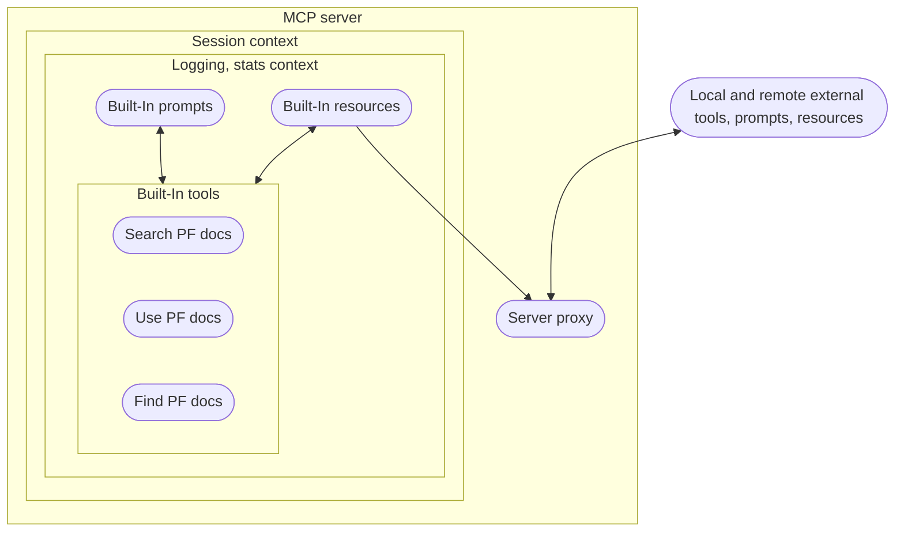

# Architecture & roadmap

## Design and core concepts

The PatternFly MCP server is centered around the concept of a library for all things PatternFly. It is intended to be extensible to meet the needs of different teams and projects, from simple to complex, from design to development.

### The library, PatternFly integration

PatternFly integration is centered around the following current, and future, tools:
- Searching for a resource
- Use and read a resource
- Finding, or discovering, a resource

#### Search PatternFly documentation

A built-in tool for searching PatternFly documentation and resources integrated into the server.

#### Use PatternFly documentation

A built-in tool for reading and using PatternFly documentation and resources integrated into the server.

#### Find and discover PatternFly documentation

An evolving "future" tool (still undergoing refinement) for finding PatternFly documentation and resources not directly integrated into the server.

> This tool treats the MCP server as a library. Like a library, sometimes you need an interlibrary loan to gain access to the resource you need.
>
> The interlibrary concept is key because it starts to highlight that this third MCP tool could
> - Help provide updates for all PatternFly MCP server built-in tools, resources, and prompts
> - Maintain up-to-date documentation and resources
> - Provide a tailored experience for users based on their use patterns (e.g., a designer's experience is tailored to design, a developer's experience is tailored to development)

### Tools, resources, and prompts as customizable plugins

Tools, resources, and prompts as customizable plugins are the result of predictable MCP SDK patterns. In the case of the PatternFly MCP server,
this actively plays a role in the library architecture because it allows us to focus on providing stability.

Key goals aided by moving towards plugins:
- **Providing a tailored experience for users** - Plugins a designer uses may differ from those of a developer, researcher, or community member.
- **Evolving/future proofing** - Plugins can evolve over time, and the MCP server can evolve to support them. (e.g., a new JS framework or design framework, etc.)
- **Maintainability** - MCP server core can focus on features and issues while plugins are added and maintained by the community.

## Server architecture

### Current state

## Roadmap

### Planned features and integrations

To get towards our future state, there are a series of planned features and integrations.

Current focus:
- **YAML configuration for remote tools, resources and prompts** - YAML configuration for remote MCP tools, resources, and prompt plugins
- **MCP resource, prompts, and helper function sharing** - A way to share MCP resources, prompts, and helper functions towards external tool plugins.
- **Find PatternFly documentation tool** - A tool that reaches out to known PatternFly documentation sources, caches locally, and integrates the results with existing MCP tools and resources.
- **PatternFly API integration** - A JSON API for PatternFly documentation, components, and patterns.
- **Hosted resource for sharing MCP tools, resources, prompts** - Shared tooling customization through PatternFly AI tooling repository (or equivalent)

Under consideration:
- **MCP client** - A tailored MCP client specific for the PatternFly MCP server.
- **Auditing for shared tools, resources, and prompts** - An auditing tool that helps you refine your shared tools, resources, and prompts.
- **Containerized PatternFly MCP server, client, and LLM** - A containerized PatternFly MCP server, client, and embedded LLM. Use your own PatternFly chat client resource.

#### Future state

