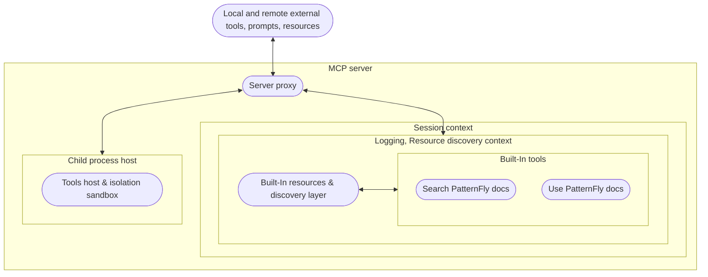
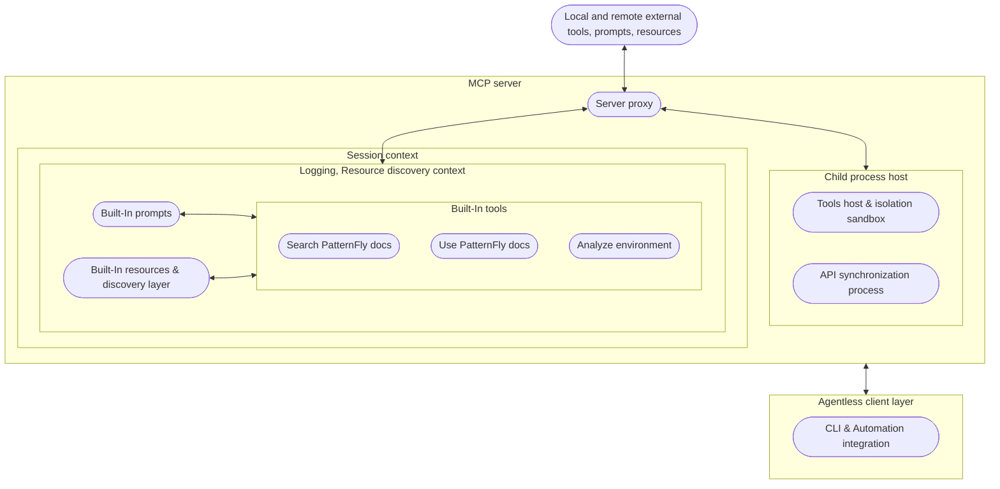

# Architecture & roadmap

## Design and core concepts

The PatternFly MCP server is centered around the concept of a library for all things PatternFly. It is intended to be extensible to meet the needs of different teams and projects, from simple to complex, from design to development.

### The library, PatternFly integration

The current PatternFly MCP server provides a hybrid documentation system that will merge baseline guidelines with dynamic content. It is centered around a **Resource Metadata** discovery layer that powers the following core concepts:

- **Searching for resources**: Querying the library for relevant documentation and components.
- **Reading resources**: Accessing full documentation and machine-readable schemas.
- **Discovering resources**: Navigating the library via resource indexes and URI templates.

#### Discovery layer (resource metadata)

Instead of a standalone "discovery" tool, the server implements a robust **Resource Metadata system**. This system:
- Generates automated indexes for all available documentation (`patternfly://docs/index`), components (`patternfly://components/index`), and schemas (`patternfly://schemas/index`).
- Supports completion logic for MCP clients, allowing LLMs and users to browse available resources effortlessly.
- Provides parameterized URI templates (RFC 6570) like `patternfly://docs/{name}` for direct, predictable access.
- Provides generated `meta` resources that document available MCP resource template parameters for MCP clients that do not have completion (`patternfly://docs/meta`, `patternfly://components/meta`, `patternfly://schemas/meta`).

> This discovery layer treats the MCP server as a living library. It enables the server to provide updates for all built-in tools and resources while maintaining a tailored experience based on user patterns (e.g., tailoring responses for designers vs. developers).

#### Hybrid documentation model (in-progress)

We'll be introducing our hybrid documentation model in upcoming releases. This concept balances stability and currentness by integrating core guidelines and standards directly into the server while syncing from the latest available PatternFly implementation.
- **Baseline data**: Core guidelines and standards integrated directly into the server for standalone purposes, quick starts, and immediate access.
- **Dynamic content**: Content synced from the latest available PatternFly implementation while you work, ensuring the LLM always has access to the latest documentation and patterns.

### Tools, resources, and prompts as customizable plugins

Tools, resources, and prompts as customizable plugins are the result of predictable MCP SDK patterns. In the case of the PatternFly MCP server,
this actively plays a role in the library architecture because it allows us to focus on providing stability.

Key goals aided by moving towards plugins:
- **Providing a tailored experience for users** - Plugins a designer uses may differ from those of a developer, researcher, or community member.
- **Evolving/future proofing** - Plugins can evolve over time, and the MCP server can evolve to support them. (e.g., a new JS framework or design framework, etc.)
- **Maintainability** - MCP server core can focus on features and issues while plugins are added and maintained by the community.

## Server architecture

### Current state

```mermaid
flowchart TD
  subgraph A1["MCP server"]
    subgraph E1["Session context"]
      subgraph F1["Logging, Resource discovery context"]
        subgraph F1A["Built-In tools"]
          F1AA(["Search PatternFly docs"])
          F1AB(["Use PatternFly docs"])
        end
        F1B <--> F1A
        F1B(["Built-In resources & discovery layer"])
      end
    end
    D1(["Server proxy"])
    D1 <--> F1
    subgraph G1["Child process host"]
      G1A(["Tools host & isolation sandbox"])
    end
    D1 <--> G1
  end
  B1(["Local and remote external tools, prompts, resources"])
  B1 <--> D1
```

## Roadmap

### Planned features and integrations

Our roadmap focuses on expanding the server's reach and providing a more integrated development experience.

#### In-progress
- **Hybrid documentation model**: A JSON API for documentation, components, and patterns that ensures the server is always in sync with the latest releases.
   - **PatternFly API Integration**: Embedded integration into the server for standalone purposes, quick starts, and immediate access.
   - **Child Process Lifecycle Management**: Background process while you work for API synchronization.

#### In-planning and under review
- **Resource-Tool Integration**: Directly integrate MCP resources into tool responses to reduce token counts and allow tools to accept URI links as inputs.
- **Environment & Analysis Tooling**: A third built-in tool focused on environment snapshots, code analysis, and whitelisted resource access for local project analysis.
- **Agentless MCP Client**: An MCP client for use without an LLM, allowing PatternFly tooling to integrate into CLI tools and CI/CD pipelines.
- **YAML Configuration**: Remote tool, resource, and prompt plugins configured via YAML.
- **Resource/Helper Sharing**: Mechanisms to share resources and helper functions across external tool plugins.

#### Future state

```mermaid
flowchart TD
  subgraph A1["MCP server"]
    subgraph E1["Session context"]
      subgraph F1["Logging, Resource discovery context"]
        F1C(["Built-In prompts"])
        F1C <--> F1A
        subgraph F1A["Built-In tools"]
          F1AA(["Search PatternFly docs"])
          F1AB(["Use PatternFly docs"])
          F1AC(["Analyze environment"])
        end
        F1B <--> F1A
        F1B(["Built-In resources & discovery layer"])
      end
    end
    D1(["Server proxy"])
    D1 <--> F1
    subgraph G1["Child process host"]
      G1A(["Tools host & isolation sandbox"])
      G1B(["API synchronization process"])
    end
    D1 <--> G1
  end
  subgraph H1["Agentless client layer"]
    H1A(["CLI & Automation integration"])
  end
  A1 <--> H1
  B1(["Local and remote external tools, prompts, resources"])
  B1 <--> D1
```
