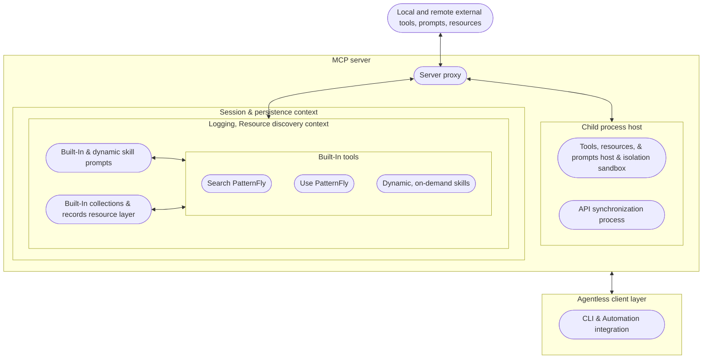

# Architecture & roadmap

## Design and core concepts

The PatternFly MCP server is centered around the concept of a library for all things PatternFly. It is intended to be extensible to meet the needs of different teams and projects, from simple to complex, from design to development.

### The library, PatternFly integration

The PatternFly MCP server is centered on a **Library of Records and Collections** that enables the following core concepts:

- **Searching for records**: Querying the library for specific documentation and component records.
- **Reading records**: Accessing full documentation and machine-readable schemas via exact hashes.
- **Discovering collections**: Navigating the library via logical groupings of records.

> [A more in-depth version of our **library synchronization** concept is currently in progress](#library-synchronization-in-progress).

#### Discovery layer (library metadata)

Instead of a standalone "discovery" tool, the server implements a robust **Library Metadata system**. This system:
- Generates automated indexes for all available **collections** (`patternfly://docs/index`, `patternfly://components/index`, `patternfly://schemas/index`) and **records**.
- Supports completion logic for MCP clients, allowing LLMs and users to browse available resources effortlessly.
- Provides parameterized URI templates (RFC 6570) like `patternfly://docs/{name}` for direct, predictable access to records.
- Provides generated `meta` resources that document available MCP resource template parameters for MCP clients that do not have completion (`patternfly://docs/meta`, `patternfly://components/meta`, `patternfly://schemas/meta`).

> This discovery layer treats the MCP server as a living library. It enables the server to provide updates for all built-in tools and resources while maintaining a tailored experience based on user patterns (e.g., tailoring responses for designers vs. developers).

#### Library synchronization (in-progress)

We'll be introducing more updates based on our library synchronization concept in upcoming releases. The base concept balances stability and currentness by integrating core guidelines and standards directly into the server while syncing from the latest available PatternFly implementation.
- **Baseline data**: Core guidelines and standards integrated directly into the server for standalone purposes, quick starts, and immediate access.
- **Dynamic content**: Content synced from the latest available PatternFly implementation while you work, ensuring the LLM always has access to the latest documentation and patterns.

### Configuration and Experimental Features

The server utilizes a centralized **Option Registry** to handle programmatic and CLI configurations. This registry manages stability by isolating new capabilities behind `experimental` flags, allowing for rapid iteration of context management and persistence features.

### Data sources and integrations

The PatternFly MCP server aggregates content from multiple official sources to provide a comprehensive development resource.

#### PatternFly ai-helpers
The server integrates the [patternfly/ai-helpers](https://github.com/patternfly/ai-helpers) repository to provide specialized, LLM-optimized guidance. This integration powers several key resource categories:
- **AI Guidance**: Specialized patterns for React Charts, Chatbot, and general React development.
- **Styling Standards**: CSS and styling requirements tailored for AI code generation.
- **Prompt Engineering**: Includes `ai-prompt-guidance.md` to help users write more effective prompts for PatternFly.

These helpers are a core part of our [Library synchronization](#library-synchronization-in-progress), acting as the bridge between stable design patterns and dynamic implementation details.

### Tools, resources, and prompts as customizable plugins

Customizable plugins for tools, resources, and prompts follow predictable MCP SDK patterns. In the case of the PatternFly MCP server,
this actively plays a role in the library architecture because it allows us to focus on providing stability.

Key goals aided by moving towards plugins:
- **Providing a tailored experience for users** - Plugins a designer uses may differ from those of a developer, researcher, or community member.
- **Evolving/future-proofing** - Plugins can evolve over time, and the MCP server can evolve to support them. (e.g., a new JS framework or design framework)
- **Maintainability** - MCP server core can focus on features and issues while plugins are added and maintained by the community.

## Server architecture

### Current state

```mermaid
flowchart TD
  subgraph A1["MCP server"]
    subgraph E1["Session context"]
      subgraph F1["Logging, Resource discovery context"]
        subgraph F1A["Built-In tools"]
          F1AA(["Search PatternFly docs"])
          F1AB(["Use PatternFly docs"])
        end
        F1B <--> F1A
        F1B(["Built-In resources & discovery layer"])
      end
    end
    D1(["Server proxy"])
    D1 <--> F1
    subgraph G1["Child process host"]
      G1A(["Tools host & isolation sandbox"])
    end
    D1 <--> G1
  end
  B1(["Local and remote external tools, prompts, resources"])
  B1 <--> D1
```

## Roadmap

### Planned features and integrations

Our roadmap focuses on expanding the server's reach and providing a more integrated user experience.

#### In-progress
- **Experimental Context Management**: Streamlining MCP resources into two primary types: **collections** and **records**. This includes providing exact hashes for records to ensure context stability.
- **PatternFly API Integration**: Transitioning to the unified Library concept for standalone purposes and latest PatternFly version access.
   - **SQLite Persistence Layer (Opt-in)**: Leveraging **Node.js 22+** to provide an optional persistence layer for up-to-date library records and resource caching.
   - **Record Seed Integration**: A "fallback" set of resource records applied to every PatternFly MCP server instance that ensures users who do not opt into SQLite persistence still receive up-to-date documentation within an average MCP server use session.

#### In-planning and under review
- **Skills-as-Tools (On Track)**: Expand MCP functionality with agent skills using common Markdown. This provides consumers with significant customization without modifying the PatternFly MCP server core. You can start contributing to the MCP now by adding skills through our [AI Plugin Marketplace](https://github.com/patternfly/ai-helpers).
- **Resource-Tool Integration**: Directly integrate MCP resources into tool responses to reduce token counts and allow tools to accept URI links as inputs.
- **Environment & Analysis Tooling**: A built-in tool falling under "use PatternFly", focused on environment snapshots, code analysis, and whitelisted resource access for local project analysis.
- **Agentless MCP Client**: An MCP client for use without an LLM, allowing PatternFly tooling to integrate into CLI tools and CI/CD pipelines.
- **Resource/Helper Sharing**: Mechanisms to share resources and helper functions across external tool plugins.

#### Deprioritized concepts and planning
- ~~**YAML Configuration**: Remote tool, resource, and prompt plugins configured via YAML.~~ Currently, superseded by Skills-as-Tools and [AI Plugin Marketplace](https://github.com/patternfly/ai-helpers).

> **Contribution alignment**
> 
> To maintain a lean and secure core, we prioritize contributions that align with our roadmap and [security policy](../SECURITY.md). The easiest way to align is to review the repo guidelines and open an issue.
>
> Contributions that overlap with upcoming roadmap items (such as the shift to modular plugins or dynamic API-level data) may be deferred or redirected to ensure they align with the future state of the project.
>
> Review our [contribution guidelines](../CONTRIBUTING.md).

#### Future state

```mermaid
flowchart TD
  subgraph A1["MCP server"]
    subgraph E1["Session & persistence context"]
      subgraph F1["Logging, Resource discovery context"]
        F1C(["Built-In & dynamic skill prompts"])
        F1C <--> F1A
        subgraph F1A["Built-In tools"]
          F1AA(["Search PatternFly"])
          F1AB(["Use PatternFly"])
          F1AC(["Dynamic, on-demand skills"])
        end
        F1B <--> F1A
        F1B(["Built-In collections & records resource layer"])
      end
    end
    D1(["Server proxy"])
    D1 <--> F1
    subgraph G1["Child process host"]
      G1A(["Tools, resources, & prompts host & isolation sandbox"])
      G1B(["API synchronization process"])
    end
    D1 <--> G1
  end
  subgraph H1["Agentless client layer"]
    H1A(["CLI & Automation integration"])
  end
  A1 <--> H1
  B1(["Local and remote external tools, prompts, resources"])
  B1 <--> D1
```
