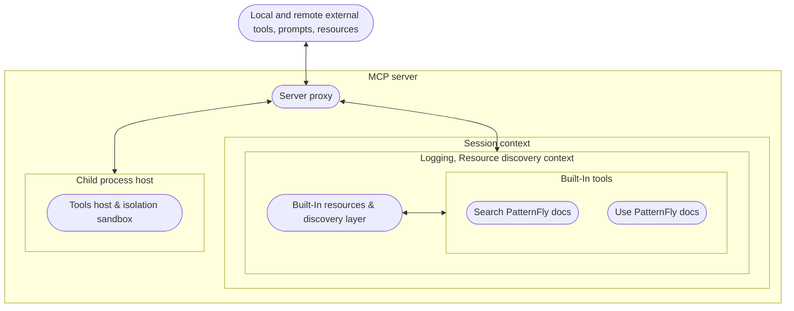
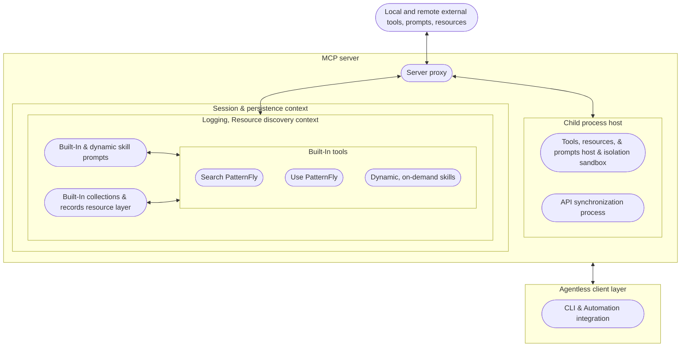

# Architecture & roadmap

## Design and core concepts

The PatternFly MCP server is centered around the concept of a library for all things PatternFly. It is intended to be extensible to meet the needs of different teams and projects, from simple to complex, from design to development.

### The library, PatternFly integration

The PatternFly MCP server is centered on a **Library of Records and Collections** that enables the following core concepts:

- **Searching for records**: Querying the library for specific documentation and component records.
- **Reading records**: Accessing full documentation and machine-readable schemas via exact hashes.
- **Discovering collections**: Navigating the library via logical groupings of records.

#### Discovery layer (library metadata)

Instead of a standalone "discovery" tool, the server implements a robust **Library Metadata system**. This system:
- Generates automated indexes for all available **collections** (`patternfly://docs/index`, `patternfly://components/index`, `patternfly://schemas/index`) and **records**.
- Supports completion logic for MCP clients, allowing LLMs and users to browse available resources effortlessly.
- Provides parameterized URI templates (RFC 6570) like `patternfly://docs/{name}` for direct, predictable access to records.
- Provides generated `meta` resources that document available MCP resource template parameters for MCP clients that do not have completion (`patternfly://docs/meta`, `patternfly://components/meta`, `patternfly://schemas/meta`).

> This discovery layer treats the MCP server as a living library. It enables the server to provide updates for all built-in tools and resources while maintaining a tailored experience based on user patterns (e.g., tailoring responses for designers vs. developers).

### Collections and data sources

First and foremost, the MCP server is an application. Collections are aggregated to provide domain-specific knowledge and directly influence MCP search relevance and retrieval precision, rather than serving as promotional metrics.

#### Primary collections

- **`patternfly-docs`**: Curated Markdown documentation and guidelines catalog (`src/docs.json`) aggregating pinned upstream repositories (`patternfly-org`, `patternfly-react`, `uxd-ai-helpers`, `patternfly-cli`, `patternfly-elements`, `patternfly-mcp`, and `pf-codemods`)
- **`patternfly-component-schemas`**: Machine-readable component JSON schemas (`@patternfly/patternfly-component-schemas`) providing runtime prop definitions and validation rules.
- **`patternfly-api`**: Live-crawled and pre-built component API specifications from PatternFly documentation endpoints.

#### Support collections

- **`ai-handbook`**: Specialized Red Hat Unified Intelligence Engineering (UIE) AI Experience (AIX) Standards for designing AI experiences, fetched dynamically from [`rh-uxd/ai-handbook`](https://github.com/rh-uxd/ai-handbook). Read the [Getting started for designers guide](https://github.com/rh-uxd/ai-handbook/blob/main/docs/getting-started-for-designers/getting-started-for-designers.md) for prompting best practices.

#### Collection architecture

- **Multi-collection partitioning**: Records are partitioned into distinct collections within the unified library, preventing namespace collisions and enabling targeted retrieval across documentation types.
- **Worker pool and background synchronization**: Background collection processing runs on dedicated worker pools and periodic schedules, with resilience fallback ensuring server availability during transient network issues.

### Configuration and experimental features

The server utilizes a centralized **Option Registry** to handle programmatic and CLI configurations. This registry manages stability by isolating new capabilities behind `experimental` flags, allowing for rapid iteration of context management and persistence features.

### Tools, resources, and prompts as customizable plugins

Customizable plugins for tools, resources, and prompts follow predictable MCP SDK patterns. In the case of the PatternFly MCP server,
this actively plays a role in the library architecture because it allows us to focus on providing stability.

Key goals aided by moving towards plugins:
- **Providing a tailored experience for users** - Plugins a designer uses may differ from those of a developer, researcher, or community member.
- **Evolving/future-proofing** - Plugins can evolve over time, and the MCP server can evolve to support them (e.g., a new JS framework or design framework).
- **Maintainability** - MCP server core can focus on features and issues while plugins are added and maintained by the community.

## Server architecture

### Current state

```mermaid
flowchart TD
  subgraph A1["MCP server"]
    subgraph E1["Session context"]
      subgraph F1["Logging, Resource discovery context"]
        subgraph F1A["Built-In tools"]
          F1AA(["Search PatternFly docs"])
          F1AB(["Use PatternFly docs"])
        end
        F1B <--> F1A
        F1B(["Built-In resources & discovery layer"])
      end
    end
    D1(["Server proxy"])
    D1 <--> F1
    subgraph G1["Child process host"]
      G1A(["Tools host & isolation sandbox"])
    end
    D1 <--> G1
  end
  B1(["Local and remote external tools, prompts, resources"])
  B1 <--> D1
```

## Roadmap

### Planned features and integrations

Our roadmap focuses on expanding the server's reach and providing a more integrated user experience.

#### In-progress

- **Dynamic MCP collection and resource invalidation and change notifications**: Emitting `sendResourceListChanged` notifications to connected MCP clients and invalidating memoized resource index caches when asynchronous or optional collections finish hydrating.
- **SQLite persistence layer (opt-in)**: Leveraging **Node.js 22+** built-in SQLite capabilities to provide an optional persistence layer for up-to-date library records and fast server startup.
- **PatternFly API crawler hardening**: Crawler throughput controls, quality filtering, and incremental crawl resume.

#### In-planning and under review

- **Resource-Tool integration**: Moving experimental MCP resources used under `experimental-context-management` into stable tooling; converting two MCP tools into a single MCP tool.
- **Collection indexing**: Indexing collections, record quality filtering, and incremental indexing.
- **Focused MCP resources**: Moving the current MCP resources to two primary resources: collections and records.
- **Skills-as-Tools (On Track)**: Expand MCP functionality with agent skills using common Markdown. This provides consumers with significant customization without modifying the PatternFly MCP server core. You can start contributing to the MCP now by adding skills through our [AI Plugin Marketplace](https://github.com/rh-uxd/ai-helpers).
- **Environment & analysis tooling**: A built-in tool falling under "use PatternFly", focused on environment snapshots, code analysis, and whitelisted resource access for local project analysis.
- **Resource and helper sharing**: Mechanisms to share resources and helper functions across external tool plugins.

#### Future concepts

- **Request-scoped session credentials**: Utilizing `AsyncLocalStorage` for credential passing to support private or token-gated collection sources.
- **Collection priority and dynamic overrides**: Introducing priority and grouping configurations for sorting and selective record overrides across overlapping collections.

#### Deprioritized concepts and planning

- **Agentless MCP client**: An MCP client for use without an LLM, allowing PatternFly tooling to integrate into CLI tools and CI/CD pipelines.
- ~~**YAML Configuration**: Remote tool, resource, and prompt plugins configured via YAML.~~ Currently superseded by Skills-as-Tools and [AI Plugin Marketplace](https://github.com/rh-uxd/ai-helpers).

> **Contribution alignment**
> 
> To maintain a lean and secure core, we prioritize contributions that align with our roadmap and [security policy](../SECURITY.md). The easiest way to align is to review the repo guidelines and open an issue.
>
> Contributions that overlap with upcoming roadmap items (such as the shift to modular plugins or dynamic API-level data) may be deferred or redirected to ensure they align with the future state of the project.
>
> Review our [contribution guidelines](../CONTRIBUTING.md).

#### Future state

```mermaid
flowchart TD
  subgraph A1["MCP server"]
    subgraph E1["Session & persistence context"]
      subgraph F1["Logging, Resource discovery context"]
        F1C(["Built-In & dynamic skill prompts"])
        F1C <--> F1A
        subgraph F1A["Built-In tools"]
          F1AA(["Search PatternFly"])
          F1AB(["Use PatternFly"])
          F1AC(["Dynamic, on-demand skills"])
        end
        F1B <--> F1A
        F1B(["Built-In collections & records resource layer"])
      end
    end
    D1(["Server proxy"])
    D1 <--> F1
    subgraph G1["Child process host"]
      G1A(["Tools, resources, & prompts host & isolation sandbox"])
      G1B(["API synchronization process"])
    end
    D1 <--> G1
  end
  subgraph H1["Agentless client layer"]
    H1A(["CLI & Automation integration"])
  end
  A1 <--> H1
  B1(["Local and remote external tools, prompts, resources"])
  B1 <--> D1
```
